# Postman

  

> [!NOTE]
> **TL;DR** - Foothold through a misconfigured Redis instance by writing an SSH key into `authorized_keys`. From the `redis` user I find an `id_rsa.bak` belonging to Matt, crack its passphrase with john, and switch to Matt. Root comes from CVE-2019-15107 on Webmin, exploited through a Metasploit module.

---

## Recon

Starting with a basic nmap scan with the following command:

```bash
nmap -sV -sC -p- 10.129.2.1 -oA nmap/postman
```

I got this output:

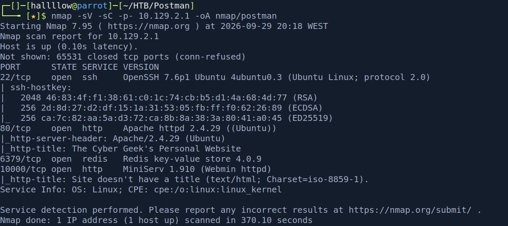

---

## Port 80 - website

Checking the webpage on port 80, I found nothing interesting. It seems a website that is still under construction.


---

## Webmin (port 10000)

Moving on to the next thing that got my attention on the `nmap` scan, I searched for the webapp running on port 10000.

It seems it's running `Webmin` in the background, a system administration app to manage `unix` and `linux` systems.

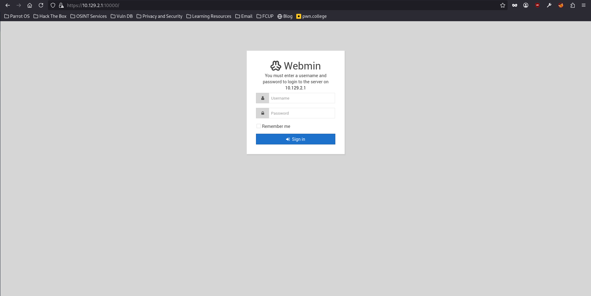

After researching a bit on the internet I stumbled on CVE-2019-15107, that basically gives us `RCE` on the machine. Trying to replicate the CVE to access the `password_change.cgi`, I got this warning:

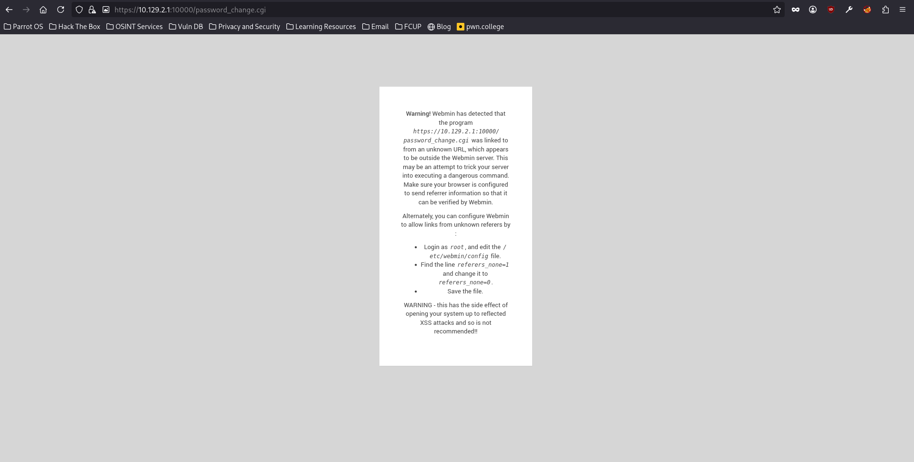

It seems that only internal persons can access it. So I started looking up for other things.

---

## Redis foothold

I moved to `Redis`. I tried to write a webshell on the `/var/www` directory but with no luck. After that I tried multiple things regarding what I saw on the internet and no luck either, so I generated an SSH key pair and put it on the Redis server:

```bash
redis-cli -h 10.129.2.1 -x set crackit < key.txt
redis-cli -h 10.129.2.1 CONFIG SET dir /var/lib/redis/.ssh
redis-cli -h 10.129.2.1 CONFIG SET dbfilename authorized_keys
redis-cli -h 10.129.2.1 SAVE
```

And then I logged in as the `redis` user.

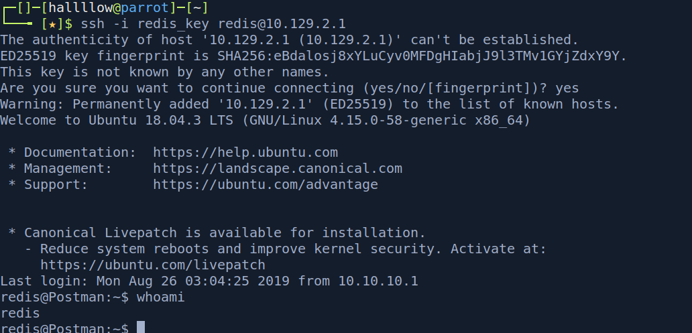

---

## redis → Matt

It seems that there are more users on the machine, and the objective is to reach `Matt`, so I started enumerating the machine to see if anything unusual.

After some enumeration on the box, I was searching in the `.bash_history` and found that the `redis` user was doing something related to an `id_rsa.bak` and switching to the `Matt` user.

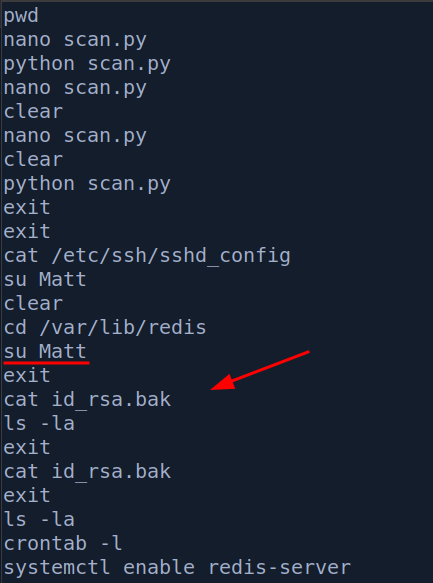

So I thought this can be the private key for the Matt user, so I did a search using:

```bash
find / -name "id_rsa.bak"
```

And found where the key is stored.

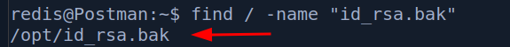

So I opened it and it was created by the user Matt, kinda sus.

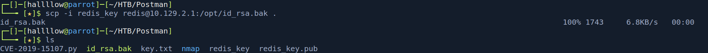

So I decided to transfer it to my machine.

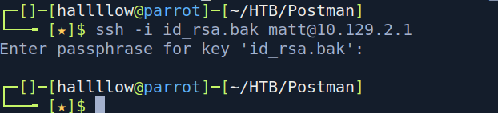

And then I tried to ssh, but no luck... it prompted the password. So the next move was: okay, I need to maybe brute force using john or something.

I used `ssh2john` to make the hash crackable and readable for john:

```bash
ssh2john id_rsa.bak > id_rsa
```

And then I cracked it using john:

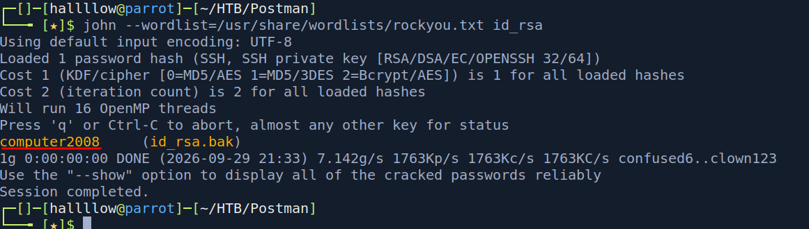

And I got the password, `computer2008`. I tried logging in using the private key but no luck, then I switched the user to Matt on the redis terminal using the password, and I got Matt!

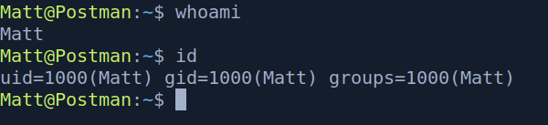

### user.txt

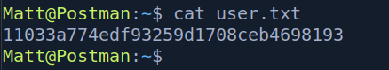

---

## Privilege Escalation - Webmin (CVE-2019-15107)

Next move is to get root on the machine, so I started my enumeration again, now to be root!

After a while I resolved to come back to the Webmin app to see if I can now replicate the vulnerable CVE, because I didn't find anything on the machine itself. After that I was trying to do the exploit manually but with no success, so I found a Metasploit module and used that:

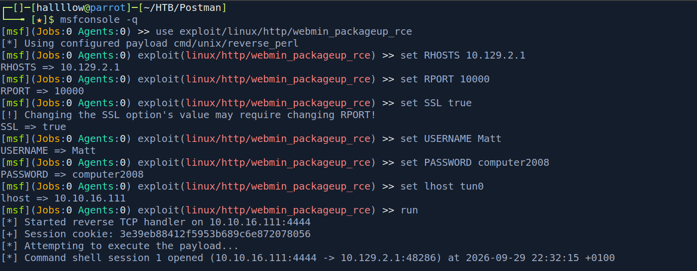

And bang, I got a root shell and opened the `root.txt`!

### root.txt

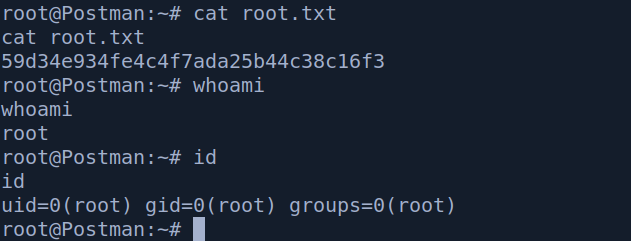

---

## Conclusion

Honestly a fun little box. The part I liked most was the Redis foothold, writing my own SSH key straight into `authorized_keys` through a misconfigured Redis felt clean, and it's a mistake you actually see in the real world when Redis is left exposed with no auth.
 
The rest was solid enumeration more than anything fancy: the `.bash_history` breadcrumb pointing at `id_rsa.bak`, cracking the passphrase with john to get Matt, and finally circling back to that Webmin CVE I'd spotted at the very start for root. What I take from it is that the answer was on the box the whole time, I just had to enumerate properly and come back to something I'd already seen. Nothing groundbreaking, but a good reminder to keep notes on everything, even the stuff that looks like a dead end early on.


---

## Kill chain summary

| Phase    | Vector                                                   | Result                           |
| -------- | -------------------------------------------------------- | -------------------------------- |
| Recon    | nmap                                                     | Attack surface (80, 6379, 10000) |
| Foothold | Redis unauth → write SSH key to `authorized_keys`        | `redis` user                     |
| User     | `id_rsa.bak` (Matt) + `ssh2john` + john → `computer2008` | `Matt` - user.txt                |
| Root     | Webmin — CVE-2019-15107 (Metasploit module)              | `root` - root.txt                |

## References

- Webmin - CVE-2019-15107 - https://nvd.nist.gov/vuln/detail/CVE-2019-15107
- Redis RCE via SSH key write - general Redis unauth technique
